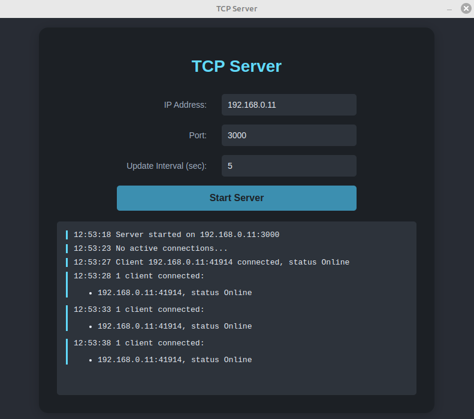
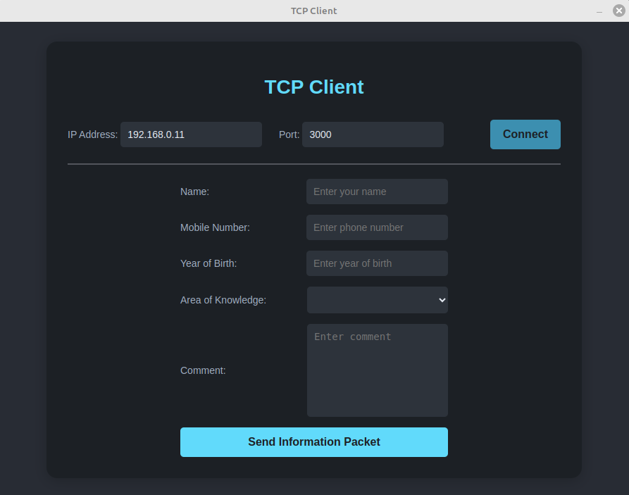

# tcp-client-server

### Showcase

    
    

### About project

The project is a client-server application running on TCP protocol. It is needed to send and receive information packets

### How does the project work?

The TCP client-server application establishes a connection between a client and a server over the TCP protocol. The server listens for incoming connections on a specified port, while the client initiates a connection to the server's IP address and port. Once the connection is established, they can exchange information packets.

### Requirements to run the application

To start the project, you will need:

1. TypeScript >= **5.5.2**
2. Node.js >= **20.11.1**
3. Electron >= **33.0.2**

### How to run the application?

1. Clone a repository:

   `git clone https://github.com/shavlenkov/tcp-client-server.git`

2. Go to the tcp-client-server folder:

   `cd tcp-client-server`

3. Run the application using the Make utility:

   `make run`
